# Nexus (N) – Social Media Platform

一個基於 Next.js 15 的現代化社交媒體平台 / A modern social media platform built with Next.js 15

[](https://vercel.com/new)

## 🌐 Deployed Link

<!-- 部署後請更新此連結 -->
<!-- Update this link after deployment -->
**Live Demo**: [https://nexus-app.vercel.app](https://nexus-app.vercel.app)

> ⚠️ 部署後請更新上述連結 / Please update the above link after deployment

## 🚀 Features / 功能清單

### Core Features / 基礎功能

#### 1. Authentication / 用戶認證
- ✅ **OAuth Login** - Google, GitHub, Facebook OAuth 登入
- ✅ **User Setup** - 用戶名（userId）設置
- ✅ **Session Management** - NextAuth.js v5 會話管理

#### 2. Post Management / 帖子功能
- ✅ **Create Posts** - 創建帖子（280字符限制）
- ✅ **Post Feed** - 帖子列表（All / Following 標籤）
- ✅ **Delete Posts** - 刪除自己的帖子
- ✅ **Character Counting** - 智能字符計數
  - URLs 統一計為 23 字符
  - Hashtags (`#tag`) 不計入字符數
  - Mentions (`@user`) 不計入字符數
- ✅ **URL Detection** - 自動識別並轉換為可點擊連結
- ✅ **Hashtag Support** - Hashtag 識別和顯示
- ✅ **Mention Support** - @提及用戶功能

#### 3. Interactions / 互動功能
- ✅ **Like/Unlike** - 點讚/取消點讚
- ✅ **Repost** - 轉發帖子
- ✅ **Comment/Reply** - 評論和回復
- ✅ **Recursive Post View** - 遞歸帖子/評論視圖
- ✅ **Post Thread Navigation** - 帖子線程導航

#### 4. User Profile / 個人資料
- ✅ **View Profile** - 查看個人資料
- ✅ **Public Profile** - 查看其他用戶公開資料
- ✅ **Edit Profile** - 編輯個人資料
  - 名稱 (Name)
  - 個人簡介 (Bio)
  - 頭像 (Avatar)
  - 橫幅圖片 (Banner Image)
- ✅ **Follow/Unfollow** - 關注/取消關注用戶
- ✅ **Profile Stats** - 帖子數、關注者、關注中統計
- ✅ **Profile Tabs** - Posts、Likes 標籤頁

#### 5. Draft Management / 草稿功能
- ✅ **Save Drafts** - 保存草稿
- ✅ **Draft List** - 查看草稿列表
- ✅ **Publish from Draft** - 從草稿發布

### Advanced Features / 進階功能

#### 1. Real-time Notifications / 實時通知系統 ⭐
- ✅ **Notification System** - 完整的通知系統
  - Like 通知 - 當有人點讚你的帖子時
  - Comment 通知 - 當有人評論你的帖子時
  - Repost 通知 - 當有人轉發你的帖子時
- ✅ **Notification Page** - 專屬通知頁面
- ✅ **Unread Badge** - 側邊欄未讀通知徽章
- ✅ **Real-time Updates** - 使用 Pusher 實時推送通知
- ✅ **Mark as Read** - 標記通知為已讀（單個/全部）

#### 2. Real-time Updates / 實時更新 ⭐
- ✅ **Live Like Count** - 點讚數實時同步
- ✅ **Live Comment Count** - 評論數實時同步
- ✅ **Multi-user Sync** - 多用戶實時同步
- ✅ **Pusher Integration** - 基於 Pusher Channels 的實時通信

#### 3. Multimedia Support / 多媒體支持 ⭐
- ✅ **Image Upload** - 圖片上傳功能
  - 頭像上傳 (Avatar Upload)
  - 橫幅圖片上傳 (Banner Upload)
- ✅ **Cloudinary CDN** - 使用 Cloudinary CDN 加速圖片加載
- ✅ **Image Optimization** - 圖片優化和轉換
- ✅ **Upload Widget** - 用戶友好的上傳組件

#### 4. Advanced Post Features / 高級帖子功能
- ✅ **Recursive Thread View** - 遞歸帖子/評論視圖
- ✅ **Post Navigation** - 帖子導航（返回上一層）
- ✅ **Reply Count** - 回復計數顯示
- ✅ **Post Linking** - 帖子連結和導航
- ✅ **Inline Composer** - 內聯帖子編輯器

#### 5. User Interactions / 用戶交互
- ✅ **Follow System** - 關注系統
- ✅ **Follower/Following List** - 關注者/關注中列表
- ✅ **Public Profile View** - 公開個人資料視圖
- ✅ **Profile Editing** - 個人資料編輯功能

## 🏗️ Architecture / 架構

### System Architecture Diagram / 系統架構圖

```mermaid
graph TB
    subgraph "Client / 客戶端"
        A[Next.js 15 App Router<br/>React Server Components]
        B[Client Components<br/>Real-time UI]
    end
    
    subgraph "Backend / 後端"
        C[Next.js API Routes<br/>Server Actions]
        D[NextAuth.js v5<br/>Authentication]
    end
    
    subgraph "Database / 資料庫"
        E[MongoDB Atlas<br/>Prisma ORM]
    end
    
    subgraph "Real-time / 實時服務"
        F[Pusher Channels<br/>WebSocket]
    end
    
    subgraph "Storage / 存儲"
        G[Cloudinary<br/>CDN & Image Processing]
    end
    
    subgraph "External Services / 外部服務"
        H[Google OAuth]
        I[GitHub OAuth]
        J[Facebook OAuth]
    end
    
    A --> C
    B --> C
    B --> F
    C --> D
    C --> E
    C --> F
    C --> G
    D --> H
    D --> I
    D --> J
    F --> B
    G --> B
    
    style A fill:#0070f3
    style B fill:#0070f3
    style C fill:#000000
    style D fill:#000000
    style E fill:#47a248
    style F fill:#300d4f
    style G fill:#3448c5
```



### Tech Stack / 技術棧

- **Frontend / 前端**
  - Next.js 15 (App Router)
  - React 18
  - TypeScript
  - Tailwind CSS
  - Radix UI
  - Lucide React Icons

- **Backend / 後端**
  - Next.js API Routes
  - NextAuth.js v5
  - Prisma ORM
  - MongoDB Atlas

- **Real-time / 實時**
  - Pusher Channels
  - WebSocket

- **Storage / 存儲**
  - Cloudinary (CDN & Image Processing)

- **Authentication / 認證**
  - NextAuth.js v5
  - OAuth (Google, GitHub, Facebook)

- **Build Tools / 構建工具**
  - Turborepo
  - Yarn Workspaces
  - ESLint
  - Prettier
  - Jest

## 📁 Project Structure / 項目結構

```
./
├── apps/
│   └── web/                 # Next.js 應用
│       ├── app/            # App Router 路由
│       │   ├── api/        # API 路由
│       │   ├── [userId]/   # 用戶資料頁面
│       │   ├── me/         # 個人資料頁面
│       │   ├── notifications/ # 通知頁面
│       │   └── post/       # 帖子頁面
│       ├── components/     # 客戶端組件
│       └── lib/            # 工具函數
│           ├── auth.ts     # 認證配置
│           ├── pusher-server.ts # Pusher 服務端
│           ├── pusher-client.ts # Pusher 客戶端
│           └── notifications.ts # 通知邏輯
├── packages/
│   ├── db/                 # Prisma 資料庫
│   │   └── prisma/
│   │       └── schema.prisma
│   ├── ui/                 # 共享 UI 組件
│   │   └── src/
│   │       ├── Sidebar.tsx
│   │       ├── PostCard.tsx
│   │       ├── PostModal.tsx
│   │       └── ...
│   ├── utils/              # 工具函數
│   └── config/             # 配置文件
└── package.json
```

## 🛠️ Setup / 安裝設置

### Prerequisites / 前置需求

- Node.js 18+ 
- Yarn
- MongoDB Atlas 連接字串
- OAuth 應用：Google, GitHub, Facebook
- Pusher Channels 應用
- Cloudinary 賬戶

### Installation / 安裝步驟

1. **Clone the repository / 克隆倉庫**
   ```bash
   git clone <repository-url>
   cd hw5
   ```

2. **Install dependencies / 安裝依賴**
   ```bash
   yarn install
   ```

3. **Set up environment variables / 設置環境變量**
   ```bash
   cp env.example .env
   ```
   
   填寫以下環境變量 / Fill in the following environment variables:
   - `DATABASE_URL` - MongoDB Atlas 連接字串
   - `NEXTAUTH_SECRET` - NextAuth 密鑰
   - `NEXTAUTH_URL` - NextAuth URL
   - `GOOGLE_CLIENT_ID` / `GOOGLE_CLIENT_SECRET` - Google OAuth
   - `GITHUB_CLIENT_ID` / `GITHUB_CLIENT_SECRET` - GitHub OAuth
   - `FACEBOOK_CLIENT_ID` / `FACEBOOK_CLIENT_SECRET` - Facebook OAuth
   - `PUSHER_APP_ID` / `PUSHER_KEY` / `PUSHER_SECRET` / `PUSHER_CLUSTER` - Pusher
   - `NEXT_PUBLIC_PUSHER_KEY` / `NEXT_PUBLIC_PUSHER_CLUSTER` - Pusher 公開配置
   - `CLOUDINARY_CLOUD_NAME` / `CLOUDINARY_API_KEY` / `CLOUDINARY_API_SECRET` - Cloudinary
   - `NEXT_PUBLIC_CLOUDINARY_CLOUD_NAME` - Cloudinary 公開配置

4. **Generate Prisma client and push schema / 生成 Prisma 客戶端並推送架構**
   ```bash
   yarn prisma:generate
   yarn db:migrate
   yarn db:seed
   ```

5. **Start development server / 啟動開發服務器**
   ```bash
   yarn dev
   ```
   
   應用將在 `http://localhost:3000` 運行

## 🧪 Testing / 測試

```bash
yarn test   # 運行測試
yarn lint   # 代碼檢查
yarn build  # 構建項目
```

## 🚀 Deployment / 部署

### Vercel Deployment / Vercel 部署

1. **Import project to Vercel / 導入項目到 Vercel**
   - 在 Vercel 中導入 GitHub 倉庫
   - 選擇根目錄作為項目根目錄

2. **Configure environment variables / 配置環境變量**
   - 在 Vercel 項目設置中添加所有環境變量
   - 確保所有必要的環境變量都已設置

3. **Deploy / 部署**
   - Vercel 會自動檢測 Next.js 項目
   - 構建完成後，應用將自動部署
   - 默認區域：`sfo1`
   - API 處理程序使用 Node runtime

### Environment Variables for Vercel / Vercel 環境變量

確保在 Vercel 項目設置中配置以下環境變量：

- `DATABASE_URL`
- `NEXTAUTH_SECRET`
- `NEXTAUTH_URL`
- `GOOGLE_CLIENT_ID` / `GOOGLE_CLIENT_SECRET`
- `GITHUB_CLIENT_ID` / `GITHUB_CLIENT_SECRET`
- `FACEBOOK_CLIENT_ID` / `FACEBOOK_CLIENT_SECRET`
- `PUSHER_APP_ID` / `PUSHER_KEY` / `PUSHER_SECRET` / `PUSHER_CLUSTER`
- `NEXT_PUBLIC_PUSHER_KEY` / `NEXT_PUBLIC_PUSHER_CLUSTER`
- `CLOUDINARY_CLOUD_NAME` / `CLOUDINARY_API_KEY` / `CLOUDINARY_API_SECRET`
- `NEXT_PUBLIC_CLOUDINARY_CLOUD_NAME`

## 📝 Scripts / 腳本

- `yarn dev` - 啟動開發服務器
- `yarn build` - 構建生產版本
- `yarn start` - 啟動生產服務器
- `yarn lint` - 運行 ESLint
- `yarn test` - 運行測試
- `yarn prisma:generate` - 生成 Prisma 客戶端
- `yarn db:migrate` - 推送 Prisma 架構到資料庫
- `yarn db:seed` - 種子資料庫

## 📊 Database Schema / 資料庫架構

主要數據模型：

- **User** - 用戶信息
- **Post** - 帖子
- **Like** - 點讚
- **Repost** - 轉發
- **Comment** - 評論（通過 Post.parentId）
- **Follow** - 關注關係
- **Draft** - 草稿
- **Notification** - 通知
- **Hashtag** - Hashtag
- **Mention** - @提及

詳細架構請參考 `packages/db/prisma/schema.prisma`

## 🔒 Security / 安全性

- ✅ NextAuth.js v5 會話管理
- ✅ OAuth 2.0 認證
- ✅ 環境變量保護
- ✅ API 路由保護
- ✅ Rate Limiting（速率限制）
- ✅ 輸入驗證（Zod）

## 📄 License / 許可證

This project is private and for educational purposes only.

## 🙏 Acknowledgments / 致謝

- Next.js Team
- Prisma Team
- Pusher Team
- Cloudinary Team
- Radix UI Team

---

**Built with ❤️ using Next.js 15**
